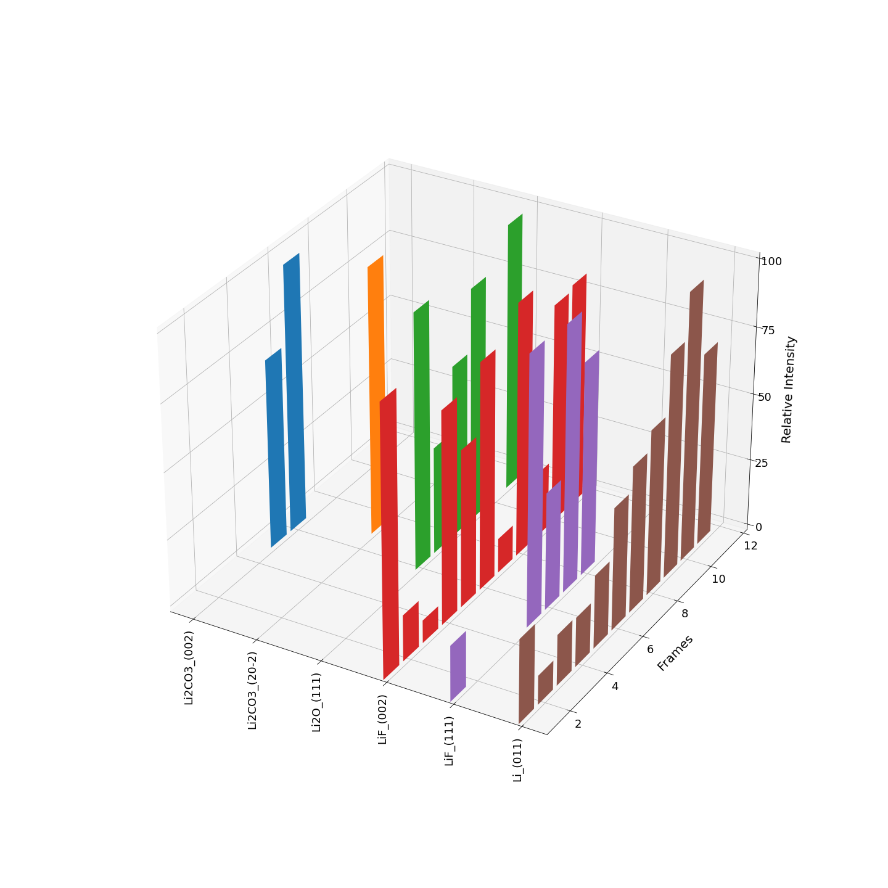
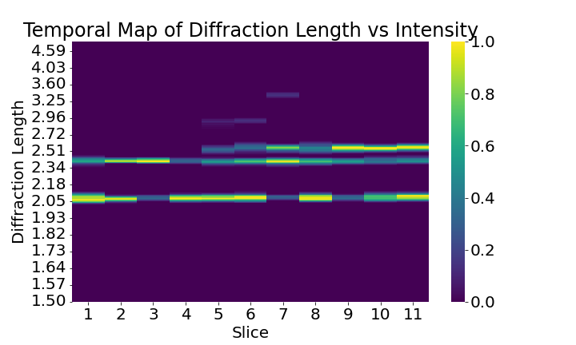

# TEM GUI LESC

[](https://opensource.org/licenses/MIT)

A graphical user interface for processing and analyzing Transmission Electron Microscopy (TEM) images.

## Features

- Process multiple TEM file formats (.dm3, .dm4, .mrc, .emd, .ser)
- Custom d-spacing database population
- Adjustable processing parameters including slice selection and detection sensitivity
- Automated image segmentation and analysis
- Comprehensive output with visualization options

## Workflow

### 1. Setup and Installation

First, install the application by following the [installation instructions](#installation-instructions) below.

### 2. Prepare Your Data

**Important:** You must manually create a folder named `put_your_data_here` in the same directory as the executable before running the application.

Place your TEM data files (.dm3, .dm4, .mrc, .emd, .ser) in this folder:


*Example: Placing a .dm4 file in the input folder*

### 3. Launch the Application

Run the executable to open the initial GUI window:


*The main interface of TEM GUI LESC*

### 4. Configure Processing Parameters

Click "Start Processing" to open the processing window where you can adjust parameters:


*Configure slice range, pixel size, detection sensitivity, and more*

### 5. View Results

**Important:** You must manually create a folder named `processed_files` in the same directory as the executable before running the application.

After processing completes, results are saved in this folder:


*Output folder structure with processed data*

Inside each processed file folder, you'll find detailed results:


*Structure of the output folder for each processed file*

Each slice directory contains comprehensive analysis data:


*Contents of an individual slice directory with analysis results*

### 6. Visualization Outputs

The application generates several visualization tools to help analyze your data:


*Heatmap visualization of processed TEM data*


*Temporal mapping of structural features*

All visualization data is also saved as CSV files in the output directory, allowing you to:
- Import the data into other plotting software
- Perform additional custom analyses
- Create publication-quality figures using your preferred tools

### 7. Console Output (Optional)

If you enable the console during installation or run as a Jupyter notebook:


*Example of console output during processing*

## Installation Instructions

### Option 1: Using the Pre-built Executable

1. Download the latest release from the [Releases](https://github.com/ganyguru/TEMGUILESC/releases) page
2. Extract the zip file to a location of your choice
3. **Important:** Create two folders in the same directory as the executable:
   - `put_your_data_here` (for input files)
   - `processed_files` (for output)
   
   The application requires these exact folder names and will not create them automatically.
4. Run the executable

### Option 2: Building from Source

1. Clone the repository into a directory of your choice
   ```
   git clone https://github.com/ganyguru/TEMGUILESC.git
   ```

2. Change directory into the project directory
   ```
   cd TEMGUILESC
   ```

3. Create a Python virtual environment
   ```
   python -m venv .venv
   ```

4. Activate the virtual environment
   - Windows:
     ```
     .venv\Scripts\activate.bat
     ```
   - macOS/Linux:
     ```
     source .venv/bin/activate
     ```

5. Install the required packages
   ```
   pip install -r requirements.txt
   ```

6. Run the application directly
   ```
   python GUI_Final.py
   ```

7. (Optional) Generate a Windows executable
   ```
   pyinstaller --add-data "database.csv;." --add-data "FFTmodelv1.hdf5;." --add-data "logo.png;." --onefile --noconsole GUI_Final.py
   ```
   The executable will be created in the `dist` directory.

## License

This project is licensed under the MIT License - see the [LICENSE](LICENSE) file for details.

## Citation

If you use this software in your research, please cite the paper:

### Paper
```
@article{TEMGUILESC2025,
  author = {Ganesh Raghavendran, Bing Han, Fortune Adekogbe, Shuang Bai, Bingyu Lu, William Wu, Minghao Zhang, Ying Shirley Meng },
  title = {Deep learning assisted high resolution microscopy image processing for phase segmentation in functional composite materials},
  doi = {10.48550/arXiv.2410.01928}
}
```


### Software

```
@software{TEMGUILESC,
  author = Ganesh Raghavendran,
  title = {TEM GUI LESC: A Graphical User Interface for Processing TEM Images},
  url = {https://github.com/ganyguru/TEMGUILESC},
  year = {2025},
}
```

## Contributing

Contributions are welcome! Please feel free to submit a Pull Request.
